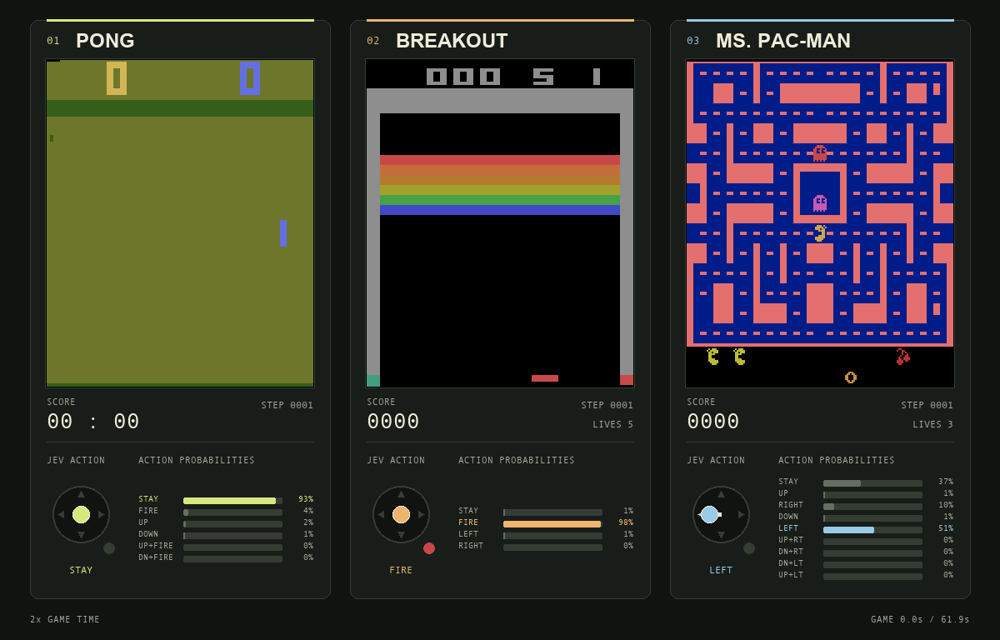

# Jev + Gymnasium

Evaluate [TypeSafe Jev](https://docs.typesafe.ai/introduction) as a policy in
Gymnasium and Atari environments. Game-specific adapters convert observations
into structured JSON; Jev selects a legal action through a single Choice question.

This project evaluates a fixed model. It records rewards and decisions without
training or updating model weights. A seeded random policy provides a local baseline.



Three games, one shared action-selection question. Joysticks and probability bars
show Jev's recorded decisions at 2× game speed. See [recording details](media/README.md)
for the source runs, rendering command, and smaller gameplay-only GIF.

```text
Environment → structured state → Jev Choice → legal action → environment
                   ↓                ↓
             RAM, frames, requests, responses, rewards → NPY / JSONL / GIF
```

| Environment | Observation adapter | Status |
| --- | --- | --- |
| CartPole | Named position, velocity, angle, and angular velocity | Supported |
| Pong | RAM or RGB object detection | Supported |
| Breakout | RAM: ball, paddle, lives, and brick map | Supported |
| Ms. Pac-Man | RAM: maze, actors, food, and local navigation | Supported |
| Montezuma's Revenge | RAM and reference room geometry | Experimental; development paused |

RAM and known room geometry provide privileged information compared with
pixel-only Atari benchmarks. Adapter limitations are documented in
[observation adapters](docs/observations.md) and the
[Montezuma prototype](docs/montezuma.md).

## Quickstart

Install [uv](https://docs.astral.sh/uv/getting-started/installation/), then from
the repository root:

```bash
uv sync --locked --extra atari --extra recording

# Local run: no credentials or API requests.
uv run --locked --no-env-file --extra atari --extra recording main.py \
  --env ALE/Breakout-v5 --policy random --max-steps 500 \
  --log runs/breakout-random.jsonl --save-npy runs/breakout-random.npy

uv run --locked --no-env-file --extra recording npy_to_gif.py \
  runs/breakout-random.npy --scale 2
```

The project uses Python 3.14 and a committed `uv.lock`. Atari runs through
[Arcade Learning Environment](https://ale.farama.org/getting-started/). No ROM
files or credentials are included in this repository. Raw experiment recordings
stay local; `media/` contains selected demonstration GIFs and a showcase preview.
CartPole can run without the Atari extra:

```bash
uv run --locked --no-env-file main.py --env CartPole-v1 --policy random
```

## Run Jev

Create `.env` from the blank template **only if you do not already have one**:

```bash
cp -n .env.example .env
```

Set `TYPESAFE_API_KEY` in your local `.env` or process environment. The `.env` file
is ignored by Git. `uv --env-file .env` loads it at runtime; the Python scripts
do not open it. CLI entry points suppress SDK/HTTP debug output and raw exception
payloads. Response capture redacts runtime credentials and excludes headers/cookies.

Start with a bounded live trial:

```bash
uv run --locked --env-file .env --extra atari --extra recording run_jev_trial.py \
  --game breakout --max-steps 64 --output-dir runs/breakout-trial
```

Game choices: `pong`, `breakout`, `mspacman`, `montezuma`, or `both` (Pong and
Breakout). The wrapper uses RAM observations, one episode, no HTTP retries, and
exports a GIF automatically. Existing outputs are never overwritten; use a new
output directory for each trial. Runs stop at game over, truncation, or the
requested decision limit.

| Setting | Default |
| --- | --- |
| Model | `jev-1.13.0` |
| Emulator frames per Atari decision | 2 |
| Sticky-action probability | 0.25 |
| Seed / episodes | 7 / 1 |
| General CLI decision limit | 500 |
| Trial-wrapper decision limit | 64 per game |
| HTTP retries | General CLI: 2; trial wrapper: 0 |

The general CLI exposes frame skipping, sticky actions, model, seed, episode count,
and replay controls. Run `main.py --help` for details. Pong uses RGB by default
in the general CLI; add `--pong-state ram` for RAM input.

The simulator pauses during each API request. Playback uses emulator time, so
network latency affects runtime but not the recorded game speed. Each decision
normally uses one API request; general-CLI retries can add requests. Check
[current TypeSafe pricing and limits](https://docs.typesafe.ai/models) before
large runs, and use logged token usage to measure cost.

## Outputs and debugging

- `.npy`: RGB frames, raw observations, exact structured states, actions, rewards,
  episode summaries, and redacted API responses.
- `.jsonl`: transition records; `.responses.jsonl`: exact redacted API requests
  and response bodies, captured before validation.
- `.gif`: game-time playback exported from the recording.

All local outputs belong under the ignored `runs/` directory. NPY files contain
pickled dictionaries; only load your own trusted recordings. Details and examples:
[recordings, replay, GIF conversion, and offline debugging](docs/recordings.md).

Join GIFs side by side, stopping when the shortest finishes:

```bash
uv run --locked --no-env-file --extra recording join_gifs.py \
  runs/pong.gif runs/breakout.gif runs/mspacman.gif --output runs/combined.gif
```

## Development

```bash
uv sync --locked --extra atari --extra recording
uv run --locked --no-env-file ruff check .
uv run --locked --no-env-file ruff format --check .
uv run --locked --no-env-file --extra atari --extra recording python -m pytest -q
```

Tests use local emulators and mock HTTP transports. No live TypeSafe requests or
API key are required. See [CONTRIBUTING.md](CONTRIBUTING.md) for adapter development
and [AGENTS.md](AGENTS.md) for agent instructions.

The core modules are `adapters.py` and the game decoders (state), `policies.py`
(action selection), `runner.py` (episode loop), `recording.py` (NPY), and
`responses.py` (redacted capture and replay), under `jev_rl/`.

## Acknowledgments

Built with [Gymnasium](https://gymnasium.farama.org/),
[ALE](https://ale.farama.org/), and [TypeSafe](https://docs.typesafe.ai/).
RAM decoding references and Montezuma room geometry draw on
[OCAtari](https://github.com/k4ntz/OC_Atari). Its license and the installed
TypeSafe skill's license are recorded in [third-party notices](THIRD_PARTY_NOTICES.md).
